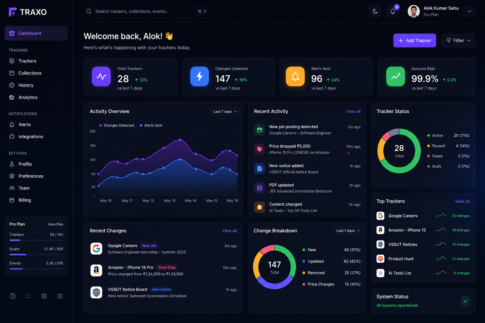
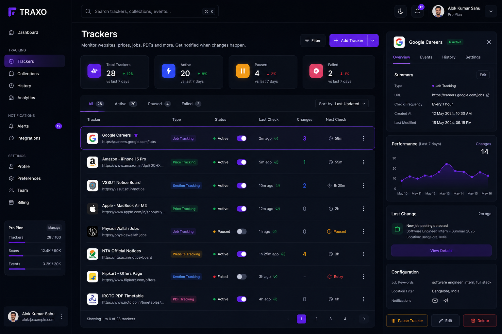
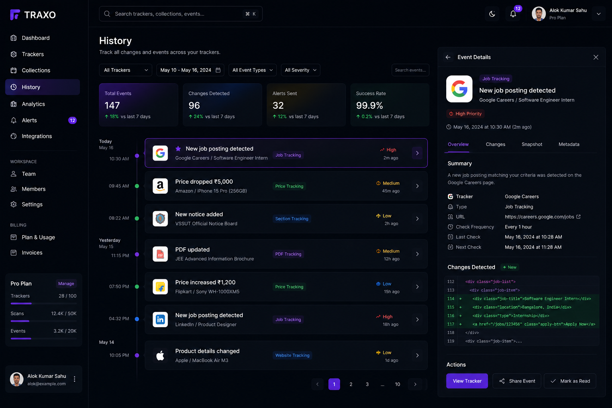
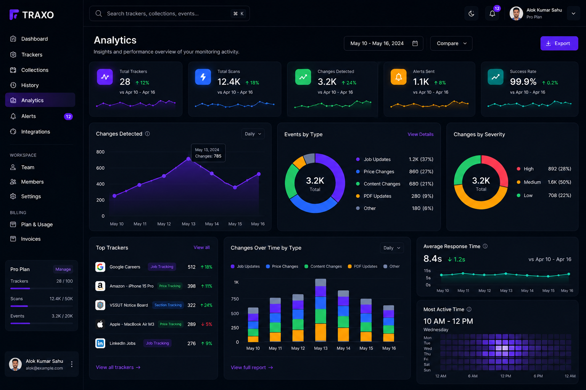
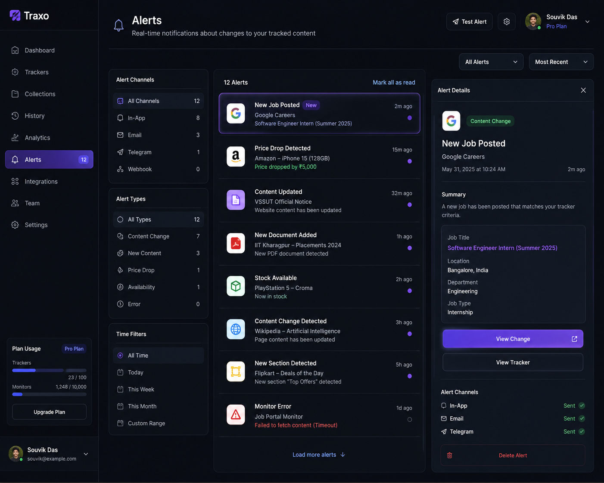
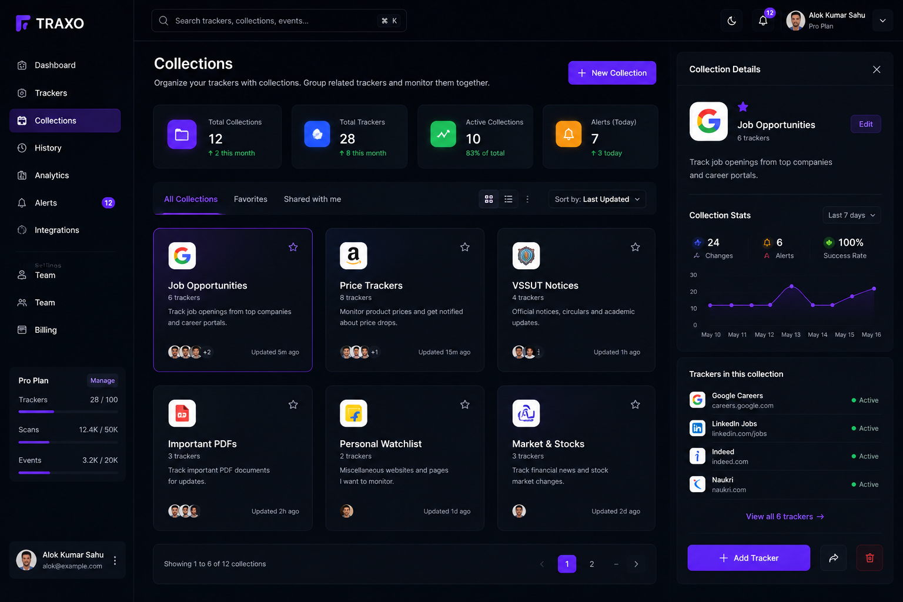
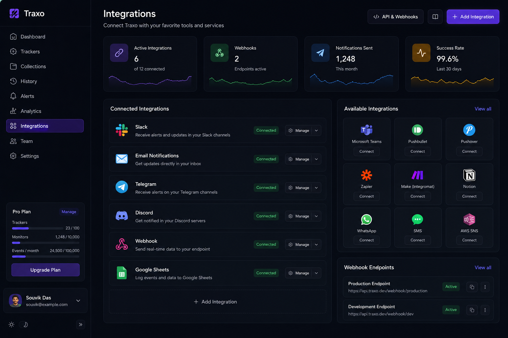
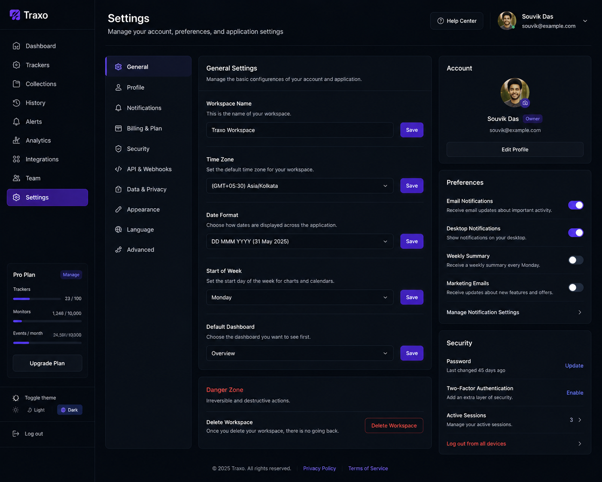

# 🌌 TRAXO — Premium Website & Change Monitor

<p align="center">
  
</p>

<p align="center">
  <a href="https://traxo.alokkumarsahu.in" target="_blank">
    
  </a>
  
  
  
  
</p>

**Traxo** is a premium, real-time website monitoring and change detection platform. It allows users to track visual, content, and price changes across any website, receive automated alerts via Email or Telegram (complete with screenshots of changes), and manage active trackers through a modern, glassmorphic analytics dashboard.

🔗 **Live Site:** [https://traxo.alokkumarsahu.in](https://traxo.alokkumarsahu.in)  
⚙️ **API Gateway:** `https://traxo-api.alokkumarsahu2100.workers.dev`

---

## 🚀 Key Features

* **🌐 Multiple Monitoring Types**:
  * **Visual Content Scrape**: Full HTML page comparison, ignoring script headers and stylesheets to focus on semantic content.
  * **Section Tracking**: Target specific elements of a webpage using CSS/XPath selectors.
  * **Price Tracking**: Watch for price drops/hikes on e-commerce sites with target alerts (supports USD/INR).
  * **Job Board Tracking**: Monitor recruitment pages and trigger alerts for matching roles or locations.
  * **PDF File Tracking**: Track modifications in downloadable PDF resources via cryptographic content hashing.

* **📸 Visual Change Screenshot Highlights**:
  * When a change is detected, the scan engine automatically takes a visual screenshot of the updated webpage using a rate-limit-free screenshot API.
  * Captures and displays visual difference indicators like mismatch percentages and total altered pixels.

* **🔔 Real-Time Multi-Channel Alerts**:
  * **Transactional Emails (via Resend)**: Premium styled glassmorphic HTML email alerts showing exactly what changed, the direct website link, and an embedded screenshot of the change.
  * **Telegram Bot Integration**: Delivers instant alerts directly into private chat threads, attaching the change screenshot as a photo and providing inline quick-action links.

* **📊 Modern Glassmorphic Dashboard**:
  * **Interactive Graphs**: Live crawler latency charts (Recharts) showing response times over the last several runs.
  * **Updates Timeline**: Chronological log of all events showing summaries, change highlights, mismatch percentages, and screenshots.
  * **Collections & Workspaces**: Organize trackers into separate collections or team workspaces.
  * **Settings & Preferences**: Toggle notification channels (Email, Telegram), set custom Webhooks, and configure Daily Digests.

---

## 🎨 Platform Screenshots & Graphics

Here is a visual walk-through of the Traxo dashboard:

### 1. Main Dashboard
Overview of active monitors, recent alerts timeline, success rates, and quick configuration.


### 2. Website Trackers Management
Create, edit, pause, and trigger scans manually. Inspect scraper configuration parameters.


### 3. Change History & Visual Diffs
Browse historical change logs and view comparative screenshots of webpage changes side-by-side.


### 4. Interactive Analytics
Real-time response time latency tracking, success rate logs, and scanning statistics.


### 5. Multi-Channel Alerts
Manage Resend email alerts and connect your Telegram account by launching the bot.


### 6. Collections & Folders
Group your website monitors into separate workflows or project collections.


### 7. Integrations & Developer Settings
Set custom outgoing Webhooks and access developer API keys for system integrations.


### 8. User Settings
Configure daily/weekly digest emails, account details, and notification thresholds.


---

## 🛠️ Tech Stack

### Frontend App
* **Framework**: Next.js 16 (React 19, TypeScript)
* **Styling**: Tailwind CSS & Vanilla CSS
* **Animations**: Framer Motion
* **State Management**: Zustand
* **Charts**: Recharts
* **Database Client**: Firebase Web SDK

### Serverless Crawl Engine
* **Runtime**: Cloudflare Workers
* **Scraper**: Cheerio & REST API calls
* **Queue System**: Cloudflare Queues (asynchronous task distributor)
* **Cron Jobs**: Cloudflare Cron Triggers (hourly, 6h, 12h, and daily schedules)
* **Storage Uploads**: Google Cloud Storage / Firebase Storage REST API
* **Screenshot API**: thum.io

### Backend & Infrastructure
* **Database**: Firebase Firestore
* **Auth**: Firebase Auth REST API (Scanner account)
* **Emails**: Resend API
* **Chat Bot**: Telegram Bot API

---

## 💻 Local Setup & Development

### 1. Prerequisites
* Node.js v18+
* npm or yarn
* A Firebase Project with Firestore enabled

### 2. Frontend Configuration
Clone the repository, create a `.env.local` file in the root directory, and fill in your Firebase credentials:
```env
NEXT_PUBLIC_FIREBASE_API_KEY=your_api_key
NEXT_PUBLIC_FIREBASE_AUTH_DOMAIN=your_auth_domain.firebaseapp.com
NEXT_PUBLIC_FIREBASE_PROJECT_ID=your_project_id
NEXT_PUBLIC_FIREBASE_STORAGE_BUCKET=your_storage_bucket.appspot.com
NEXT_PUBLIC_FIREBASE_MESSAGING_SENDER_ID=your_sender_id
NEXT_PUBLIC_FIREBASE_APP_ID=your_app_id

# Outgoing mail configuration
RESEND_API_KEY=your_resend_api_key
TELEGRAM_BOT_TOKEN=your_telegram_bot_token
```

Install dependencies and start the development server:
```bash
npm install
npm run dev
```
Open [http://localhost:3000](http://localhost:3000) to view the application.

### 3. Serverless Crawler Configuration
Navigate to the workers directory:
```bash
cd workers/api
```
Create wrangler secrets for your scanner credentials:
```bash
wrangler secret put FIREBASE_SCANNER_EMAIL
wrangler secret put FIREBASE_SCANNER_PASSWORD
```

Deploy the Cloudflare Worker:
```bash
wrangler deploy
```

---

## 📄 License
This project is open-source and available under the MIT License.
